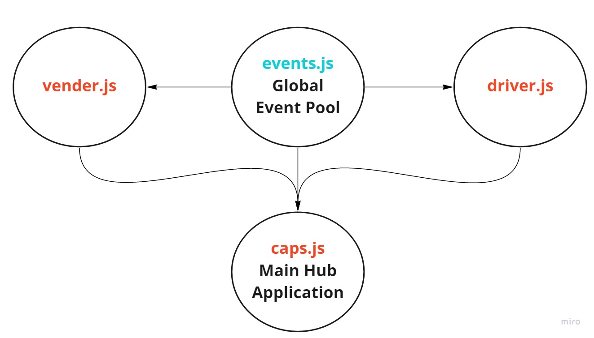

# caps

### Author: Abdallah Zakaria

## Setup 
  - `npm init -y`
  - `npm i  dotenv `
  - add .env file 
  - pass your STORE_NAME
  - start the server `node caps.js`

## Test 
  - `npm i jest` then `npm test`
  - `npm i -D eslint` then `npm run lint` 

## UML
